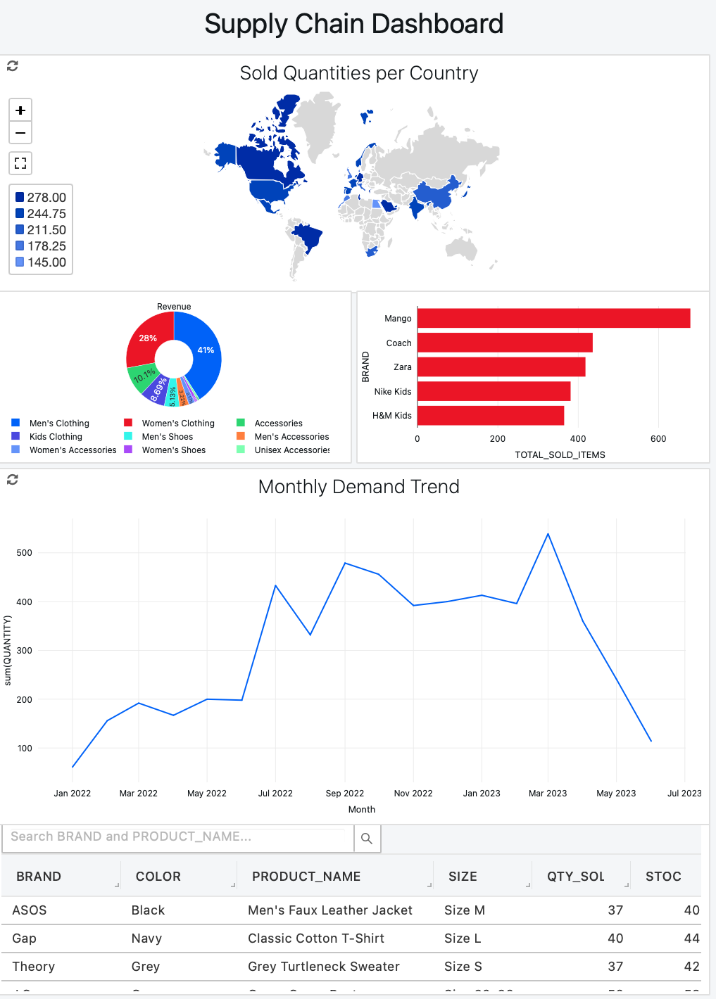

# Data Management with Databricks: Big Data with Delta Lakes

## Overview

This project, **Data Management with Databricks: Big Data with Delta Lakes**, was an enriching experience where I explored the capabilities of Delta Lakes in Databricks for managing big data efficiently. The project involved creating Delta Tables, transforming data using Python, querying data with SQL, and leveraging Delta Lake's advanced features such as merge operations and version control.

## Key Learnings

1. **Creating Delta Tables**: I set up Delta Tables in Databricks and wrote data to them, gaining insights into schema validation and data storage optimization for performance and reliability.

2. **Data Transformation and Querying**: Using Python, I performed data transformations on the Delta Tables. I then used SQL to query the data, extracting insights necessary for building a comprehensive dashboard.

3. **Advanced Delta Lake Features**: I explored the merge operation in Delta Lake to efficiently update data within the Delta Tables. Additionally, I utilized version control features to track changes and access previous versions of the data.

## Project Details

### Scenario

In this project, I worked as a Data Engineer for an online clothing brand tasked with building a dashboard to analyze order history. The dashboard aimed to inform purchasing behavior and ensure adequate inventory for the upcoming holiday season.

### Steps Undertaken

- **Databricks Setup**: Created a free account on Databricks and uploaded JSON files into Databricks DBFS.
- **Delta Table Creation**: Established Orders and Inventory Delta Tables, ensuring schema validation.
- **Data Transformation**: Applied Python transformations to convert data types, remove null values, and add computed columns.
- **SQL Querying**: Executed SQL queries on the Orders Delta Table to extract insights for KPIs such as quantity sold by country and sales by category.
- **Dashboard Creation**: Built visualizations and a dashboard based on the queried data, including monthly sales trends.
- **Data Updates**: Used the merge operation to update the Orders Delta Table.
- **Version Control**: Queried previous versions of the Orders Delta Table using time travel features.

### Key Operations

- **Medallion Architecture**: Implemented Bronze, Silver, and Gold layers for data transformation.
- **Merge Operations**: Efficiently updated tables using Delta Lake's merge feature.
- **Time Travel**: Leveraged time travel to access previous versions of Delta Tables.

## Dashboard Visualization

Below is a snapshot of the dashboard created during this project:

## Skills Developed

This project significantly enhanced my skills in:

- Data engineering using Databricks
- Python programming for data transformation
- SQL for data querying and analysis
- Utilizing advanced features of Delta Lake for efficient data management

## Conclusion

Completing this project equipped me with practical experience in managing big data projects using Databricks and Delta Lakes. It provided me with valuable insights into building end-to-end data pipelines that integrate various data sources, apply transformations, and deliver analysis-ready data.

Feel free to explore the code provided in the attached Jupyter Notebook (`Data-Management-with-Databricks_-Big-Data-with-Delta-Lakes.ipynb`) for detailed implementation steps.
